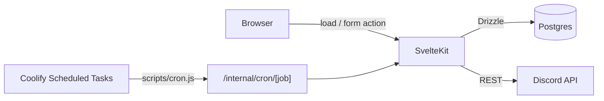
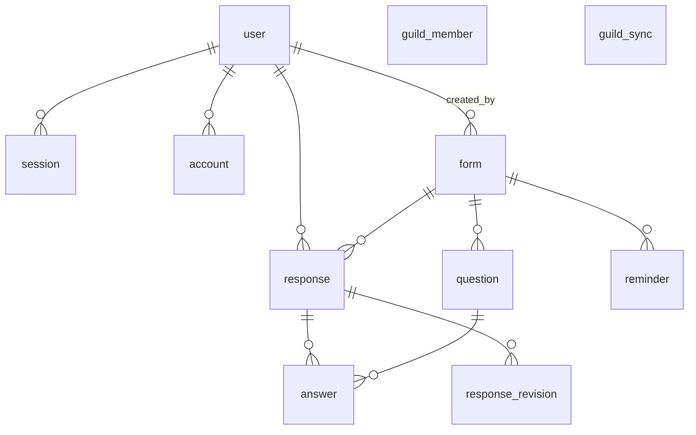
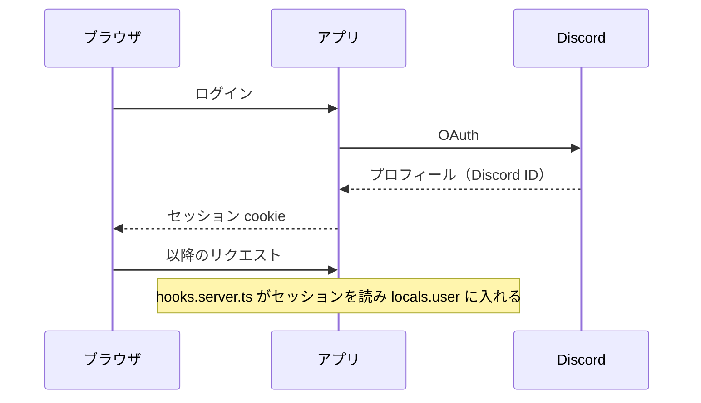
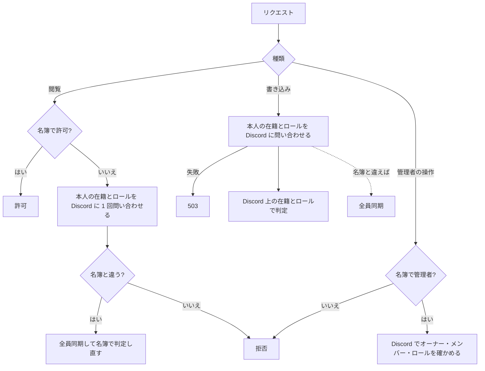

# 設計

コードを変えて、ここに書いてあることが変わるなら、同じ変更でこの文書も更新する。

## 全体像

SvelteKit（adapter-node）の単一コンテナ。Discord は Bot の REST だけを使い、Gateway は使わない。

## Discord API

| API | 用途 | 呼び出し元 | 制限（実測） |
| --- | --- | --- | --- |
| `GET /guilds/{guild}/members?limit=1000` | 全員同期 | `runFullSync` | 10 回/10 秒。Server Members Intent が必要 |
| `GET /guilds/{guild}/members/{user}` | 本人の在籍とロールの確認、管理者の確認 | `reconcileMember`、`isGuildAdmin` | 5 回/秒 |
| `GET /guilds/{guild}` | オーナー | `runFullSync`、`isGuildAdmin` | 実質無制限 |
| `GET /guilds/{guild}/roles` | ロールの権限と名前 | `runFullSync`、`isGuildAdmin`、作成画面、管理画面 | 実質無制限 |
| `GET /guilds/{guild}/channels` | 告知チャンネルの選択肢と検証 | 作成画面 | 未計測 |
| `POST /channels/{channel}/messages` | 告知とリマインド（リマインドは告知への返信で、50 人ずつメンション） | `announceForm`、`sendReminder` | 未計測 |

- ログインの OAuth は Better Auth の Discord プロバイダが扱う。
- 429 は `retry_after` だけ待って再試行する。1 回のリクエストは 10 秒でタイムアウトする。

## DB

| テーブル | 役割 |
| --- | --- |
| `user` `session` `account` `verification` | Better Auth。`user.discord_id` は OAuth のプロフィールからだけ入る |
| `guild_member` | 名簿。Discord サーバーのメンバーを全員同期で写したもの。抜けた人も行を残し `left_at` を入れる |
| `guild_sync` | 1 行だけ。最後に成功した全員同期の時刻と、その時点のオーナー・ロール権限 |
| `form` | フォーム。`deadline`（告知した締切）・`closes_at`（受付終了の予定）・`closed_at`（実際にクローズした時刻）を別々に持つ。クローズで対象者（`final_target_ids`）と未提出者（`final_non_submitters`）を確定する |
| `question` | 質問。削除は `deleted_at` の論理削除 |
| `response` / `answer` | 最新の回答。1 人 1 フォーム 1 件 |
| `response_revision` | 送信のたびに回答全体を 1 版として残す。同じ内容の再送では増えない |
| `reminder` | リマインドの送信記録。自動は締切ごとに 1 件（部分ユニーク `reminder_auto_once_uq`） |

ロックの順序:

| 処理 | 順序 |
| --- | --- |
| 回答の送信 `submitResponse` | `form` を `FOR SHARE` → `response` を INSERT（重複は DO NOTHING）→ 編集なら `response` を `FOR UPDATE` → `answer` の入れ直し・`response_revision` の追加 |
| クローズ `closeForm` | `form` を `FOR UPDATE` → 名簿と回答を読む → `form` を UPDATE |
| 全員同期 `runFullSync` | advisory lock → `guild_member` の upsert・離脱の UPDATE → `guild_sync` の upsert |

- 送信のトランザクションで `form` の行に書き込まない。`FOR SHARE` の後に同じ行を UPDATE すると、同時に来た初回の回答どうしがデッドロックする。
- トランザクションの中で Discord などの外部 I/O を待たない。全員同期とクローズは、Discord からの取得をトランザクションの前に済ませる。

## 認証と認可

| 操作 | 判定 | Discord への問い合わせ |
| --- | --- | --- |
| 閲覧（トップ・回答・結果・作成画面を開く） | 名簿（`gateMember`） | 名簿で拒否されるときだけ、本人の在籍とロールを 1 回問い合わせる。名簿と違っていれば全員同期して判定し直す |
| 回答の送信・フォームの作成 | Discord 上の在籍とロール（`confirmMember`） | 毎回 1 回。問い合わせに失敗したら 503 |
| 作成者としての管理操作（クローズ・再開・告知・リマインド・名簿の更新） | Discord 上の在籍（`canManageForm(..., 'act')`） | 毎回 1 回 |
| 管理者としての管理操作 | 名簿で管理者でなければその場で拒否し、管理者なら Discord で確かめる（`isGuildAdmin`） | 名簿で管理者のときだけ 3 回 |
| 管理画面（`requireAdmin`） | Discord 上の権限 | 毎回 3 回 |
| 管理者向けリンクの表示 | 名簿（`looksLikeGuildAdmin`） | なし |

- 名簿は拒否にだけ使う。許可は、閲覧を除いて Discord で確かめる。
- 本人への問い合わせは 1 リクエストにつき 1 回（`WeakMap` でリクエスト単位に使い回す）。同じ人への同時の問い合わせはまとめる。
- 閲覧は名簿で許可するので、抜けた人やロールを外された人は次の全員同期まで閲覧できる。書き込みはできない。

## 定期処理

Coolify の Scheduled Tasks が `node scripts/cron.js <job>` を実行し、`POST /internal/cron/<job>` を `CRON_SECRET` 付きで叩く。アプリ内にタイマーは持たない。

| job | 間隔 | 内容 |
| --- | --- | --- |
| `tick` | 5 分 | 締切 24 時間前から締切までのフォームに自動リマインドを 1 回送る。受付終了を過ぎたフォームをクローズする |
| `sync-members` | 1 日 | 全員同期 |

- 同じ job が実行中なら 409 を返して何もしない。`CRON_SECRET` が未設定なら常に拒否する。
- 自動リマインドは送信前に予約の行を入れ、締切ごとの部分ユニークで重複を防ぐ。投稿に失敗すると予約を消し、次の tick で送り直す。

## 同期のタイミング

名簿（`guild_member`）と `guild_sync` を書くのは全員同期（`syncAllMembers`）だけ。全員同期は、同じプロセス内では実行中のものを共有し、プロセスをまたいでは advisory lock で 1 本ずつにする。

| タイミング | 理由 |
| --- | --- |
| 日次 cron（`sync-members`） | 拾えなかった変化の反映 |
| 管理画面の同期ボタン | 手動の修復 |
| リマインド・クローズの直前 | 古い名簿でメンションしたり確定したりしない |
| 結果ページの「名簿を更新」 | 確定前の未提出者を最新にする。開いただけでは同期しない |
| フォーム作成の直後 | 「ロールを付ける → 作る」の順で未提出者を最新にする |
| 本人の問い合わせで名簿との違いが見つかったとき | 上の認証と認可を参照 |

メンバーのロール構成の変化は、本人の問い合わせで見つかれば直る。ロールの権限だけの変更とオーナー交代は、次の全員同期まで名簿に反映されない。
