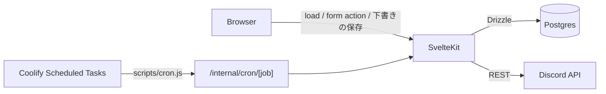
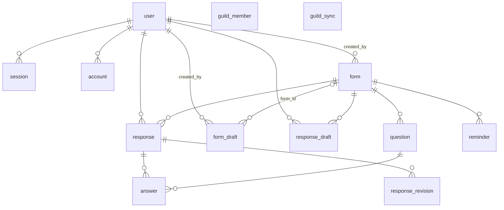
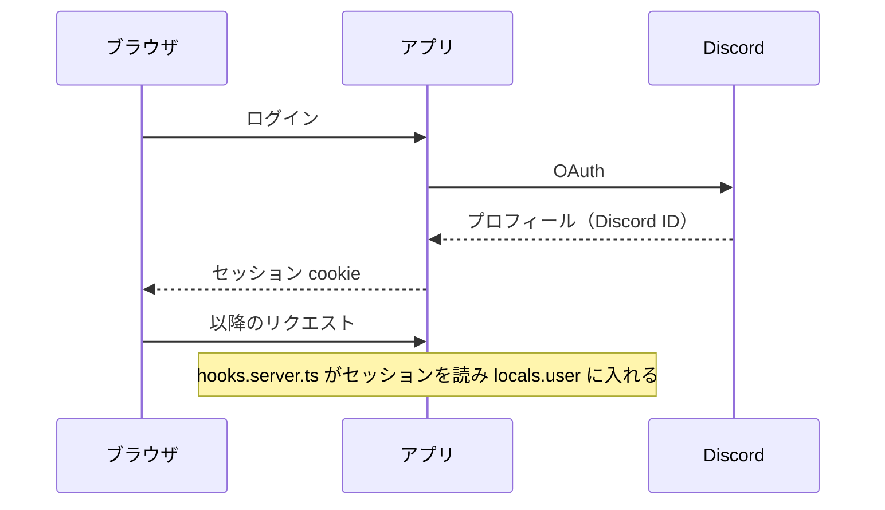
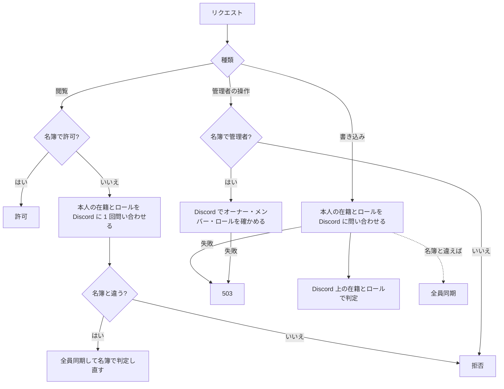

# 設計

コードを変えて、ここに書いてあることが変わるなら、同じ変更でこの文書も更新する。

## 全体像

SvelteKit（adapter-node）の単一コンテナ。Discord は Bot の REST だけを使い、Gateway は使わない。

リクエスト本文の上限は adapter-node の既定（512KB）のまま。フォーム全体・回答全体・下書きに UTF-8 のバイト数の上限（`MAX_FORM_BYTES`、`MAX_RESPONSE_BYTES`、`MAX_DRAFT_BYTES`、`MAX_RESPONSE_DRAFT_BYTES`）を設け、送信の本文が 512KB に収まるようにしている。

## Discord API

| API | 用途 | 呼び出し元 | 制限（実測） |
| --- | --- | --- | --- |
| `GET /guilds/{guild}/members?limit=1000` | 全員同期 | `runFullSync` | 10 回/10 秒。Server Members Intent が必要 |
| `GET /guilds/{guild}/members/{user}` | 本人の在籍とロールの確認、管理者の確認 | `reconcileMember`、`isGuildAdmin` | 5 回/秒 |
| `GET /guilds/{guild}` | オーナー | `runFullSync`、`isGuildAdmin` | 実質無制限 |
| `GET /guilds/{guild}/roles` | ロールの権限と名前 | `runFullSync`、`isGuildAdmin`、作成画面、編集画面、管理画面 | 実質無制限 |
| `GET /guilds/{guild}/channels` | 告知チャンネルの選択肢と検証 | 作成画面、編集画面 | 未計測 |
| `POST /channels/{channel}/messages` | 告知・リマインド・締め切り・締切の変更の投稿。後の3つは告知への返信 | `announceForm`、`sendReminder`、`postCloseNotice`、`postDeadlineChange` | 未計測 |
| `PATCH /channels/{channel}/messages/{message}` | 告知の本文を今のフォームに合わせる | `refreshAnnouncement` | 未計測 |

- ログインの OAuth は Better Auth の Discord プロバイダが扱う。
- 429 は `retry_after` だけ待って再試行する。1 回のリクエストは 10 秒でタイムアウトする。

## DB

| テーブル | 役割 |
| --- | --- |
| `user` `session` `account` `verification` | Better Auth。`user.discord_id` は OAuth のプロフィールからだけ入る |
| `guild_member` | 名簿。Discord サーバーのメンバーを全員同期で写したもの。抜けた人も行を残し `left_at` を入れる。アバターはアカウント用（`avatar_hash`）とサーバー用（`guild_avatar_hash`）を持つ |
| `guild_sync` | 1 行だけ。名簿を最後に書いた全員同期が Discord から取得を始めた時刻と、そのときのオーナー・ロール権限 |
| `form` | フォーム。`deadline`（告知した締切）・`closes_at`（受付終了の予定）・`closed_at`（クローズした時刻。自動クローズでは `closes_at` と同じ値）を別々に持つ。クローズで対象者（`final_target_ids`）と未提出者（`final_non_submitters`）を確定する。締め切りの投稿は `close_notice_claimed_at` で予約し、`close_message_id` に結果を持つ。`version` は編集を保存するたびに 1 増える。`announced_content` は告知に最後に投稿または編集した本文。今のフォームから作る本文と違えば告知は古い。null（記録する前に告知したフォーム）は結果画面では古いと表示しないが、`refreshAnnouncement` は編集して記録する |
| `question` | 質問。削除は `deleted_at` の論理削除。編集で消した選択肢は `options` に `deleted: true` を付けて残し、回答のラベルに使う。回答画面・集計には出さない |
| `response` / `answer` | 最新の回答。1 人 1 フォーム 1 件 |
| `response_revision` | 送信のたびに回答全体を 1 版として残す。同じ内容の再送では増えない |
| `reminder` | リマインドの送信記録。自動は締切ごとに 1 件（部分ユニーク `reminder_auto_once_uq`）。メンションした人（`target_discord_ids`）とまだの人（`pending_discord_ids`）を分けて持つ |
| `form_draft` | 作成画面と編集画面の下書き。エディタの入力を `payload`（jsonb）に検証せずに持つ。`version` で古い画面からの上書きを 409 で止める。作成が成功すると同じトランザクションで消す。フォームの複製もこの行を作る。編集の下書きは `form_id` と編集を始めた `form.version`（`base_version`）を持ち、1 フォーム 1 人 1 行（部分ユニーク `form_draft_edit_uq`）。編集画面を開くと作られ、編集の保存で消える。下書きを一度も保存していない行が、ほかの人の編集の保存で古くなっていれば、開いたときに消して作り直す。トップの下書き一覧には出さない |
| `response_draft` | 回答画面の下書き。1 人 1 フォーム 1 行。`version` で古い画面からの上書きを 409 で止める。送信とクローズで消す。本人にしか見えず、提出数やリマインドには影響しない |

ロックの順序:

| 処理 | 順序 |
| --- | --- |
| 回答の送信 `submitResponse` | `form` を `FOR SHARE` → 検証に使った `version` と違えば `form_changed` で何も書かずに終える → `response` を INSERT（重複は DO NOTHING）→ 編集なら `response` を `FOR UPDATE` → 本人の `response_draft` の DELETE → `answer` の入れ直し・`response_revision` の追加 |
| クローズ `closeForm` | `form` を `FOR UPDATE` → 名簿と回答を読む → `form` を UPDATE → そのフォームの `response_draft` の DELETE |
| 締め切りの投稿 `postCloseNotice` | `form` の条件付き UPDATE で予約（未予約のときだけ）→ 投稿はトランザクションの外 → 予約が残っているときだけ `form` を UPDATE。クローズのトランザクションの後に走る |
| 回答の下書きの保存 `saveResponseDraft` | `form` を `FOR SHARE` → `isClosed` なら 409 → `response_draft` を版 0 なら INSERT（重複は DO NOTHING）、それ以外は条件付き UPDATE。`response` には触れない |
| 全員同期 `runFullSync` | advisory lock → `guild_sync` を読み、後から取得を始めた同期がコミット済みなら何も書かずに終える → `guild_member` の upsert・離脱の UPDATE → `guild_sync` の upsert |
| フォームの作成 `createForm` | 作成の `form_draft` の DELETE → `form` と `question` の INSERT。`form` の行のロックは取らない |
| 編集の保存 `publishFormEdit` | `form` を `FOR UPDATE` → `closed_at` か `version` の食い違いなら 409 → `response` と `reminder` を読み、回答があれば対象ロール・提出できる人・既存の質問の種類、告知かリマインドを投稿済みなら告知チャンネルの変更を 400 で止める → `form` を UPDATE（`version` を増やす）→ `question` の UPDATE・INSERT・論理削除 → 本人の編集の `form_draft` の DELETE |
| 告知の更新 `refreshAnnouncement` | `form` を読む → 編集はトランザクションの外 → 読んだときと `version` が同じときだけ `announced_content` を UPDATE。ほかの編集の保存が入れば古いまま残り、次の更新で直る |
| 下書きの保存 `updateDraft` | `form_draft` の条件付き UPDATE だけ。ほかの行には触れない |
| リマインドの送信 `sendReminder` | 1 通ごとに `reminder` を `FOR UPDATE` → 未送信から 50 人をメンション済みに移す。投稿はトランザクションの外 |

- 送信のトランザクションで `form` の行に書き込まない。`FOR SHARE` の後に同じ行を UPDATE すると、同時に来た初回の回答どうしがデッドロックする。
- `response_draft` は `form` の行のロックの後に書く。保存の `FOR SHARE` とクローズの `FOR UPDATE` が順番を決めるので、クローズの後に下書きは残らない。
- 編集の保存は回答の有無を `response` から読む。`form` の `FOR UPDATE` の下なので、送信と入れ違いにならない。送信は保存の前に読んだ質問で検証していれば、`form_changed` で止まる。回答画面は描いたときの `version` も送り、それが古ければ同じく止まる。
- トランザクションの中で Discord などの外部 I/O を待たない。全員同期とクローズは、Discord からの取得をトランザクションの前に済ませる。編集の保存も、ロールとチャンネルの検証と、対象ロールを変えたときの全員同期を外で行う。
- 編集の保存の後、トランザクションの外で、告知が古いか本文が未記録なら編集する（`refreshAnnouncement`）。締切が変わり、編集画面で「締切の変更を Discord で知らせる」が付いていて、告知があれば、その後に告知への返信をメンションなしで投稿する（`postDeadlineChange`）。どちらも失敗しても保存は成功のままで、結果画面にエラーを出す。告知の編集は結果画面の「告知を更新」からやり直せる。締切の返信は送り直さない。

## 認証と認可

| 操作 | 判定 | Discord への問い合わせ |
| --- | --- | --- |
| 閲覧（トップ・回答・結果・作成画面を開く、結果の CSV `GET /forms/[id]/results/csv`） | 名簿（`gateMember`） | 名簿で拒否されるときだけ、本人の在籍とロールを 1 回問い合わせる。名簿と違っていれば全員同期して判定し直す |
| 回答の送信・フォームの作成 | Discord 上の在籍とロール（`confirmMember`） | 毎回 1 回。問い合わせに失敗したら 503 |
| 作成者としての管理操作（クローズ・再開・告知・告知の更新・リマインド・名簿の更新・編集の保存） | Discord 上の在籍（`canManageForm(..., 'act')`） | 毎回 1 回。問い合わせに失敗したら 503。編集の保存では入力を残すため、エディタに 503 の失敗として返す |
| 管理者としての管理操作 | 名簿で管理者でなければその場で拒否し、管理者なら Discord で確かめる（`isGuildAdmin`） | 名簿で管理者のときだけ 3 回。問い合わせに失敗したら 503 |
| 管理画面（`requireAdmin`） | Discord 上の権限 | 毎回 3 回。問い合わせに失敗したら 503 |
| 管理者向けリンクの表示 | 名簿（`looksLikeGuildAdmin`） | なし |
| 下書きの保存・破棄（破棄はトップの `?/discardDraft`） | 名簿（`requireMember`）。他人の下書きは 404 | 閲覧と同じ。本人以外に影響しないので、書き込みでも毎回は問い合わせない |
| 回答の下書きの保存・破棄 | 名簿で回答画面を開ける人（`requireSubmitter`）。対象は常にセッションの本人の行 | 閲覧と同じ。本人以外に影響しないので、書き込みでも毎回は問い合わせない |
| フォームの複製 | 作成者と管理者だけ（`requireFormManager(..., 'view')`） | 管理者のときだけ 3 回 |
| 編集画面を開く・編集の破棄（`/forms/[id]/edit` の `?/reload`） | 作成者と管理者だけ（`requireFormManager(..., 'view')`）。対象は常にセッションの本人の編集の下書き | 管理者のときだけ 3 回 |

- 名簿は拒否にだけ使う。許可は、閲覧と下書きを除いて Discord で確かめる。
- 許可を Discord で確かめる判定は、問い合わせに失敗したら（通信の失敗、5xx、429 の再試行の上限など）どれも同じ文言の 503 にする。DB のエラーは 500 のまま。
- 下書きの JSON エンドポイント（作成画面の保存の `POST /forms/drafts` と `PUT /forms/drafts/[id]`、編集画面の保存も後者、回答画面の保存と破棄の `PUT /forms/[id]/draft` と `DELETE /forms/[id]/draft`）は SvelteKit の CSRF 検査の対象外なので、`Origin` が自分のオリジンと一致しなければ 403 にする。作成画面の下書きの破棄はトップの form action（`?/discardDraft`）で、CSRF 検査は SvelteKit に任せる。
- 本人への問い合わせは 1 リクエストにつき 1 回（`WeakMap` でリクエスト単位に使い回す）。同じ人への同時の問い合わせはまとめる。
- 閲覧は名簿で許可するので、抜けた人やロールを外された人は次の全員同期まで閲覧できる。書き込みはできない。

## 定期処理

Coolify の Scheduled Tasks が `node scripts/cron.js <job>` を実行し、`POST /internal/cron/<job>` を `CRON_SECRET` 付きで叩く。アプリ内にタイマーは持たない。

| job | 間隔 | 内容 |
| --- | --- | --- |
| `tick` | 1 分 | 締切 24 時間前から締切までのフォームに自動リマインドを 1 回送る。受付終了を過ぎたフォームをクローズする。クローズから 24 時間以内で、締め切りの投稿がまだのフォームに投稿する |
| `sync-members` | 1 時間 | 全員同期 |

- 同じ job が実行中なら 409 を返して何もしない。`CRON_SECRET` が未設定なら常に拒否する。
- 自動リマインドは送信前に予約の行を入れ、締切ごとの部分ユニークで重複を防ぐ。
- 途中で失敗した送信は、送れた分を記録して残す。次のリマインドは自動・手動を問わず、残った送信があればその続き（古いものから 1 件）を、まだメンションしていない未提出者にだけ送って終える。残った送信がないときだけ新しく送る。
- 自動が手動の送信の続きを送っても、その締切の自動リマインドを送ったことにはならず、後の tick が新しく送る。
- 締め切りの投稿は、クローズの直後に行う。失敗してもクローズは成功のままで、次の tick が送り直す。

## 同期のタイミング

名簿（`guild_member`）と `guild_sync` を書くのは全員同期（`syncAllMembers`）だけ。`syncAllMembers` は、呼ばれた後に Discord から取得を始めた同期の結果を返す。同じプロセス内で同期が実行中なら、その後に 1 本だけ続けて走らせ、実行中に来た呼び出しはみなそれを待つ。プロセスをまたいでは advisory lock で 1 本ずつにし、後から取得を始めた同期が先にコミットしていれば、古い一覧で上書きしない。名簿の `synced_at` と `guild_sync.last_full_sync_at` は、取得を始めた時刻。

| タイミング | 理由 |
| --- | --- |
| 毎時の cron（`sync-members`） | 拾えなかった変化の反映。抜けた人やロールを外された人が閲覧できるのは最長 1 時間 |
| 管理画面の同期ボタン | 手動の修復 |
| リマインド・クローズの直前 | 古い名簿でメンションしたり確定したりしない |
| 結果ページの「名簿を更新」 | 確定前の未提出者を最新にする。開いただけでは同期しない |
| フォーム作成の直後 | 「ロールを付ける → 作る」の順で未提出者を最新にする |
| 対象ロールを変えた編集の保存の直後 | 作成の直後と同じ |
| 本人の問い合わせで名簿との違いが見つかったとき | 上の認証と認可を参照 |

メンバーのロール構成の変化は、本人の問い合わせで見つかれば直る。ロールの権限だけの変更とオーナー交代は、次の全員同期まで名簿に反映されない。
